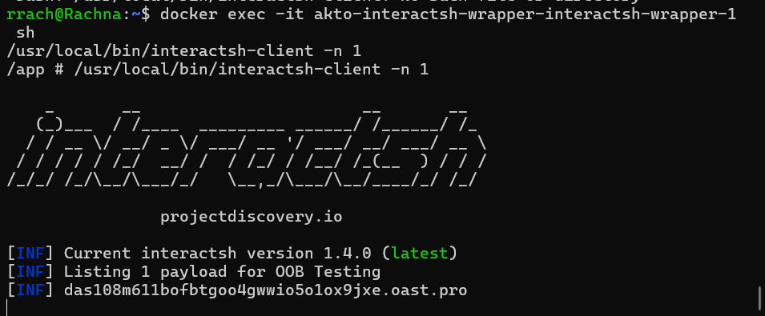
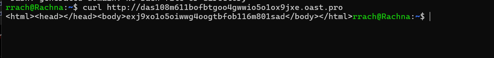
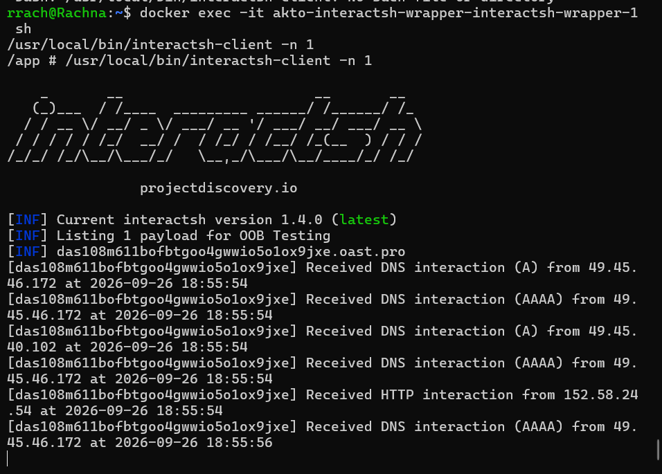

# akto-interactsh-wrapper (Node.js / TypeScript)

An HTTP wrapper around [interact.sh](https://github.com/projectdiscovery/interactsh)
exposing the two APIs from the assignment spec:

| Endpoint | Method | Purpose |
|---|---|---|
| `/api/getURL` | `POST` (GET also works) | Allocates a new interactsh testing-server URL for the current session |
| `/api/getInteractions` | `GET` | Returns caller IP + timestamp for every interaction on a given URL, optionally filtered by a time window |

## Demo

### 1. Generate an Interactsh Domain



### 2. Trigger a Request



### 3. Retrieve Interactions



## Approach

There's no first-party interactsh client library for Node/TypeScript (the
official one is the Go module used internally by the CLI). Reimplementing
interact.sh's registration/AES-encrypted-polling protocol from scratch in TS
is possible but heavy for what's needed here, so instead this wrapper drives
the official **`interactsh-client` CLI binary** (downloaded prebuilt from its
GitHub releases — no Go toolchain needed anywhere) as a subprocess — one
process per session — and parses its stdout, which already contains
everything required: the assigned domain, and a line per interaction
(protocol, caller IP, timestamp). This matches the assignment's "read the
interactsh repo, extract what you need" suggestion, just applied to the
CLI's output instead of the Go source directly.

- `POST /api/getURL` spawns a new `interactsh-client -n 1` process and waits
  for it to print its assigned subdomain, e.g.:
  ```
  [INF] Listing 1 payload for OOB Testing
  [INF] c23b2la0kl1krjcrdj10cndmnioyyyyyn.oast.pro
  ```
  That domain is the session key returned to the caller, and is exactly what
  `getInteractions` expects back.
- From then on, every line the process prints matching
  `Received <PROTOCOL> interaction ... from <ip> at <timestamp>` is parsed
  and appended to that session's in-memory interaction list.
- Because each session is its own OS process, **multiple concurrent users**
  are naturally isolated from each other — no shared client state.
- A background sweep every minute kills and evicts any session that hasn't
  been queried via `getInteractions` in the last hour, so long-running
  servers don't accumulate zombie subprocesses.

## Project layout

```
.
├── src/
│   ├── server.ts              # express app + wiring
│   ├── types.ts                # shared Interaction type
│   ├── session/manager.ts      # spawns/parses/tracks interactsh-client processes
│   └── routes/api.ts           # the two HTTP handlers
├── Dockerfile                   # builds interactsh-client + the TS app, slim runtime
├── docker-compose.yml
├── package.json / tsconfig.json
```

## Running locally (no Docker)

Requires Node.js 20+ and a working `interactsh-client` binary on your `PATH`.
Grab the prebuilt binary for your platform from the
[interactsh releases page](https://github.com/projectdiscovery/interactsh/releases)
(look for an asset like `interactsh-client_<version>_linux_amd64.zip`), unzip
it, and either move the `interactsh-client` binary into somewhere on your
`PATH` (e.g. `/usr/local/bin`) or point `INTERACTSH_BINARY` at wherever you
put it. No Go installation is required for this.

```bash
npm install
npm run build
npm start
```

or for local iteration without a build step:

```bash
npm install
npm run dev
```

Environment variables:

| Var | Default | Description |
|---|---|---|
| `PORT` | `8080` | HTTP port to listen on |
| `INTERACTSH_BINARY` | `interactsh-client` | Path to the CLI binary |
| `INTERACTSH_SERVER_URL` | *(CLI default)* | Pass a custom/self-hosted interactsh server, e.g. `oast.pro` |

## Running with Docker

The Dockerfile downloads the prebuilt `interactsh-client` binary from its
GitHub release (no Go toolchain involved at all) and bundles it alongside
the built TypeScript app:

```bash
docker compose up --build
```

or without compose:

```bash
docker build -t interactsh-wrapper .
docker run -p 8080:8080 interactsh-wrapper
```

## Trying it out

**1. Get a session URL:**

```bash
curl -X POST http://localhost:8080/api/getURL
# {"url":"c23b2la0kl1krjcrdj10cndmnioyyyyyn.oast.pro"}
```

**2. Trigger an interaction** (from anywhere):

```bash
curl http://c23b2la0kl1krjcrdj10cndmnioyyyyyn.oast.pro
```

**3. Fetch interactions for that session:**

```bash
curl "http://localhost:8080/api/getInteractions?url=c23b2la0kl1krjcrdj10cndmnioyyyyyn.oast.pro"
```

```json
{
  "url": "c23b2la0kl1krjcrdj10cndmnioyyyyyn.oast.pro",
  "count": 1,
  "interactions": [
    { "protocol": "HTTP", "callerIp": "43.22.22.50", "timestampRaw": "2026-09-26 12:26", "timestamp": "2026-09-26T12:26:00.000Z" }
  ]
}
```

**Optional time-window filter:**

```bash
curl "http://localhost:8080/api/getInteractions?url=<url>&from=2026-09-26T10:00:00Z&to=2026-09-26T13:00:00Z"
```

A URL with no active/known session returns `404` with
`{"error": "no active session for the given URL"}`.

## Design notes / edge cases considered

- **Multiple simultaneous users** — one OS process + in-memory buffer per
  session, keyed by URL; no cross-user shared mutable state beyond the
  session map itself.
- **Resource cleanup** — idle sessions (no `getInteractions` call in the
  last hour) are killed and evicted by a background timer, so the process
  list doesn't grow unbounded.
- **Optional time filtering** — `getInteractions` accepts `from`/`to` as
  ISO-8601 query params.
- **Self-hosted interactsh server** — `INTERACTSH_SERVER_URL` is passed
  straight through to the CLI's `-server` flag, so this works against a
  self-hosted `interactsh-server` too.

## Known limitation / heads-up

This was written in a sandboxed environment **with no internet access**, so
I couldn't `npm install`, compile `interactsh-client`, or actually run the
two processes together end-to-end before handing it over. The parsing
regexes in `src/session/manager.ts` are built directly off the exact sample
output shown in the assignment doc (`[INF] Listing N payload...`,
`[INF] <domain>`, `Received <PROTO> interaction ... from <ip> at <ts>`), but
CLI flag names (`-n`, `-server`) and exact spacing/wording can shift between
`interactsh-client` releases. Run it once locally (`docker compose up --build`)
before recording your demo — if a line doesn't match, it's a one-line regex
tweak in `manager.ts`, not a structural problem.
